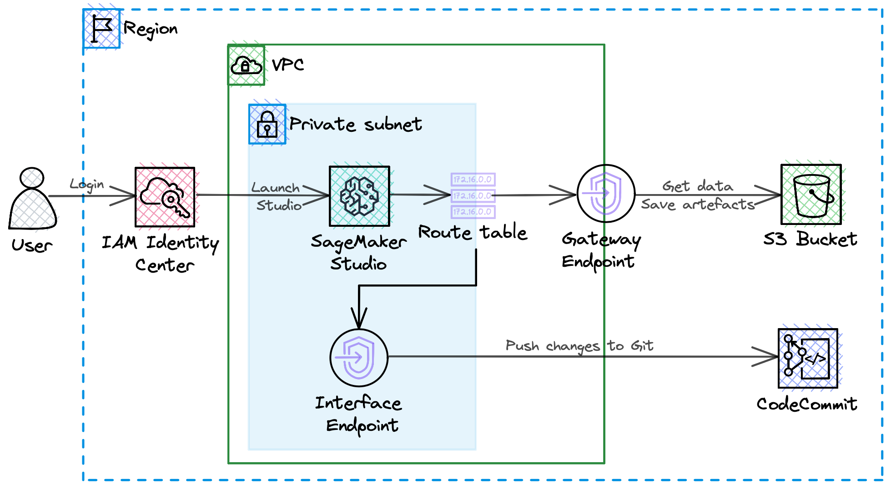
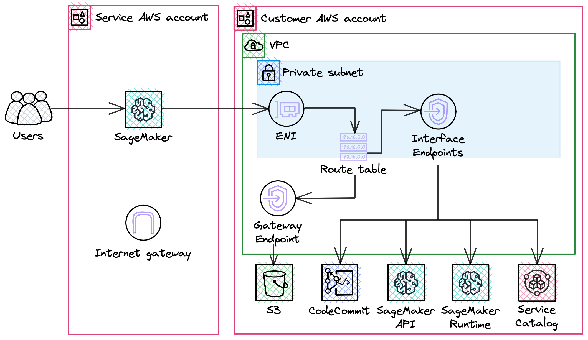

# Migration of local data science workspaces to SageMaker
**Table of Contents**

- [Workspace requirements](#workspace-requirements)
  * [Problem Context](#problem-context)
  * [Constraints](#constraints)
  * [Functional requirements](#functional-requirements)
  * [Non-functional requirements](#non-functional-requirements)
- [Proposed solution](#proposed-solution)
  * [Architecture diagram](#architecture-diagram)
  * [Cost breakdown](#cost-breakdown)
  * [Deployment](#deployment)

## Workspace requirements

### Problem Context
The data science team used Jupyter notebooks and PyCharm IDE on their local machines to train models but had issues with model's performance and configuration tracking. They used Google Sheets to track model's name, parameters values used and performance. It quickly became messy with the increasing number of models. Also, team members wanted to collaborate with each other when building models.

### Constraints
- **C-1** Data is stored in AWS S3.
- **C-2** Users' credentials should be stored in AWS IAM Identity Center (SSO).
- **C-3** AWS CodeCommit is selected as a version control system.

### Functional requirements
- **FR-1** Solution provides collaborative development.
- **FR-2** Solution can be integrated/expanded with AWS EMR.

### Non-functional requirements
- **NFR-1 **Data and code should not be transferred via public internet.
- **NFR-2** Data scientists should not have access to the public internet.

## Proposed solution

> 💡 *Everything in software architecture is a trade-off. First Law of Software Architecture*

Migrate local development environment to AWS SageMaker Studio and enable SageMaker Experiments and SageMaker Model Registry to track models' performance.
SageMaker Studio will be launched in VPC only mode to make connection to Amazon EMR available and to satisfy the requirement of disabling access to the public internet.

### Architecture diagram

The solution consists of the following components:
- VPC with S3 Gateway Endpoint and one Private Subnet with Interface Endpoint to allow data/code transfer without public internet.
- IAM Identity Center to reuse existing credentials and enable SSO to SageMaker.
- AWS SageMaker Studio
- AWS S3 buckets to get data and save models artefacts
- AWS CodeCommit repository to store code

### Cost breakdown

| Service | Configuration | Monthly cost |
| --- | --- | --- |
| Interface Endpoint | 5 Endpoints in 1 AZ, Data processing (400 GB per month) in EU (Frankfurt) | $47.80 |
| S3 Gateway Endpoint | Provided at no cost | $0.00 |
| SageNaker instances | ml.t3.medium in EU (Frankfurt) - 500 hours per month | $29.00 |
| Amazon S3 | S3 standard (0.5 GB)| $0.01 |
| AWS IAM Identity Center | Provided at no cost  | $0.00 |
|TOTAL COST |  | $76.81 |

### Deployment

All network infrastructure components are prepared using IaC tool - AWS CDK.

[CDK assets](cdk-assets/) 